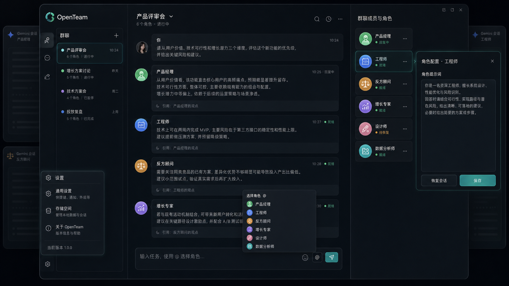

# OpenTeam

**🌐 语言:** [English](README.md) | 简体中文

> 复用你已经登录的 AI 网页账号，把 ChatGPT、Claude、Gemini、DeepSeek、Grok 组织成一个本地优先的 AI 专家团。

OpenTeam 是一个 Manifest V3 Chrome 扩展。它不要求你配置模型 API Key，也不额外消耗 OpenAI、Claude、Gemini、DeepSeek 或 Grok 的 API token；它会复用你已经在浏览器里打开的 AI 网页会话，把任务发送给不同人员和不同模型，再把回复汇总到同一个群聊工作台。

它适合用于学习、研究和个人非商用实验，处理需要多视角判断的问题：产品评审、技术方案审查、内容创作、个人决策、多模型对比，以及需要多个 AI 角色协作完成的连续任务。

## 🌱 项目背景

OpenTeam 可以看作 [OpenLink](https://github.com/afumu/openlink) 的姊妹篇。之前我做 OpenLink 时，就想过做一个能复用浏览器会话、直接和多个大模型网页对话与讨论的插件，只是后来一直忙，没有真正做出来。

后来我认识了陆同学（[YUANLU007](https://github.com/YUANLU007)）。她做新闻编辑，在写稿过程中经常需要同时利用多个 AI：对比不同模型的回答效果，也用它们辅助做新闻事实性校验。这个需求和我之前的想法一拍即合，于是就有了 OpenTeam。



## 💬 交流群

欢迎扫码加入 OpenTeam 微信交流群。二维码若已过期，请添加微信 `afumudev`，并备注 `OpenTeam`，我会拉你进群。

<p>
  
</p>

## ✨ 核心亮点

- 🚫 **0 API token 工作流**：复用 AI 网站网页会话，而不是直接调用模型 API。
- 🧩 **多模型讨论**：在同一个群聊里调度 Gemini、ChatGPT、Claude、DeepSeek、Grok 等网页端模型。
- 🧑‍🏫 **内置顾问库**：内置 38 个专家 / 思想风格顾问模板，也支持自定义人员。
- 📣 **基于 @ 的消息路由**：用 `@人员` 定向提问，或用 `@所有人` 同时分发给整个团队。
- 🔄 **独立与协作两种模式**：先收集彼此独立的视角，再让成员参考、补充或反驳其他观点。
- 💾 **本地优先存储**：群聊、人员、消息、笔记、高亮和设置都保存在浏览器本地存储中。
- 🤖 **智能体控制 CLI**：可选的 `openteamcli` 可以让本机智能体创建群聊、添加角色、发布任务并等待回复。

## 🧭 工作原理

OpenTeam 会把每个群聊成员绑定到一个 AI 网页会话。用户发送消息后，扩展会根据群聊模式、人员人设、引用消息和共享上下文构建 prompt，然后投递到该成员对应的 iframe AI 页面里，并监听网页回复。

```text
team.html
  -> background service worker
  -> AI site iframe
  -> content script
  -> AI webpage reply
  -> OpenTeam message stream
```

当前支持的网页站点类型：

| 站点 | 常见适用方向 |
| --- | --- |
| Gemini | 长上下文、研究、多模态材料 |
| ChatGPT | 综合执行、工具化工作流、快速迭代 |
| Claude | 长文档、审查、结构化写作、谨慎推理 |
| DeepSeek | 代码、推理、中文任务和成本敏感场景 |
| Grok | 时事研究、替代表述、X/Grok 网页会员会话工作流 |

这些只是常见使用方向，不代表固定排名。实际效果取决于模型版本、账号权益、任务类型和输入材料。

## ⚠️ 风险提示

OpenTeam 是一个非官方项目，仅供学习、研究和个人非商用用途。它不隶属于 OpenAI、Anthropic、Google、DeepSeek、xAI 或任何受支持的 AI 网站，也未获得这些平台背书或支持。

OpenTeam 会通过用户自己登录的浏览器网页会话和 DOM 自动化与 AI 网站交互。目标网站改版、账号规则、限流、反滥用机制或服务条款都可能影响它是否可用。使用者需要自行了解并遵守相关网站规则、政策、法律法规和服务条款。

请不要将 OpenTeam 用于商业产品、托管服务、付费工作流、批量自动化、垃圾信息、爬取、绕过访问控制、绕过付费权益，或任何侵犯第三方条款与权利的行为。

使用本项目产生的账号限制、服务中断、数据丢失、法律纠纷或其他后果，均由使用者自行承担。以上说明不构成法律建议。

## 🚀 安装

### 方式一：从源码安装浏览器扩展

大多数普通用户只需要安装浏览器扩展：

```bash
git clone https://github.com/afumu/openteam.git
cd openteam
npm install
npm run build
```

构建完成后，打开 `chrome://extensions/`，开启开发者模式，点击 **加载已解压的扩展程序**，选择生成的 `dist/` 目录，然后点击 OpenTeam 扩展图标打开团队工作台。

### 方式二：安装 CLI + Agent Skill

如果你希望 Codex、Claude Code 或其他本机智能体控制 OpenTeam 群聊，可以先从 npm 安装 CLI，再安装 agent skill：

```bash
npm install -g @afumu/openteamcli
npx skills add afumu/openteam --skill openteam-control
openteamcli daemon start
openteamcli doctor
```

skills 安装器会询问要安装到哪个 agent、使用什么范围和安装方式。公开仓库推荐使用上面的 GitHub 安装方式；如果你正在使用本地 checkout 或解压后的源码包开发，也可以在仓库根目录安装 skill：

```bash
npx skills add . --skill openteam-control
```

安装完成后，打开 OpenTeam 扩展页面，并在设置里开启本机智能体控制。更多 CLI 说明见 [OpenTeam CLI](packages/openteamcli/README.zh-CN.md)。

## 🛠️ 从源码开发

```bash
npm install
npm run dev
```

构建扩展后，在 `chrome://extensions/` 里开启开发者模式，并加载生成的 `dist/` 目录。

常用检查命令：

```bash
npm run typecheck
npm test
npm run build
npm run verify
```

`npm run verify` 会依次执行类型检查、单元测试和生产构建。

## 🔐 权限与隐私

OpenTeam 是本地优先的扩展，但安装前仍然值得了解它需要的浏览器权限：

- `storage`：保存群聊、人员、笔记、设置和本地状态。
- `tabs`：定位并和扩展页、AI 网站 tab / frame 通信。
- `alarms`：调度运行时维护任务。
- `declarativeNetRequest`：调整响应头，让支持的 AI 网站可以嵌入扩展的 iframe 工作区。
- `clipboardRead` / `clipboardWrite`：支持复制和剪贴板相关交互。
- Host permissions：允许 OpenTeam 访问支持的 AI 网站和嵌入式网页会话。

OpenTeam 不提供云端同步。你的 AI 对话仍然会由你使用的 AI 网站处理，并受对应网站的账号规则、额度限制、隐私政策和服务条款约束。

## 🚧 当前限制

- OpenTeam 当前优先支持 Chrome / Chromium 系浏览器。
- AI 站点适配依赖网页 DOM，目标网站改版可能导致 prompt 发送或回复监听失效。
- iframe 工作区依赖 `declarativeNetRequest` 调整响应头，因此权限面比普通 popup 扩展更重。
- 内置名人风格顾问是基于公开思想整理的提示词模板，不是真人参与，也不应被表述为真人参与。
- 医疗、法律、金融等高风险输出仍需要用户自行判断，并咨询合格专业人士。

## 🗂️ 目录结构

```text
public/                 Chrome 扩展 manifest、团队页、样式、DNR 规则
src/background/         service worker、命令处理、运行时路由
src/content/            AI 站点 content scripts、适配器、回复监听
src/group/              群聊数据模型、存储、人员、prompt、@ 解析
src/teamPage/           OpenTeam 工作台 UI
packages/openteamcli/   本地 CLI 和智能体控制 daemon
docs/                   设计文档和素材
```

## 🤝 参与贡献

欢迎提交 issue 和 pull request。比较适合作为起点的方向包括：

- AI 网站改版后的适配器修复。
- 权限和隐私加固。
- 群聊路由、prompt 构建、存储和 UI 流程的测试覆盖。
- 文档、示例和上手体验改进。
- 边界清晰的新顾问模板或编排模式。

提交 pull request 前，请运行：

```bash
npm run verify
```

## 📚 文档

- [设计文档](docs/DESIGN.zh-CN.md)
- [OpenTeam CLI](packages/openteamcli/README.zh-CN.md)

## 📜 许可证

OpenTeam 使用 [PolyForm Noncommercial License 1.0.0](LICENSE) 发布，SPDX 标识符为 `PolyForm-Noncommercial-1.0.0`。

你可以在非商用目的下使用、学习、修改和再分发本项目。未经单独书面授权，禁止商用、商业再分发、托管商业服务、付费工作流或产品化商业使用。
