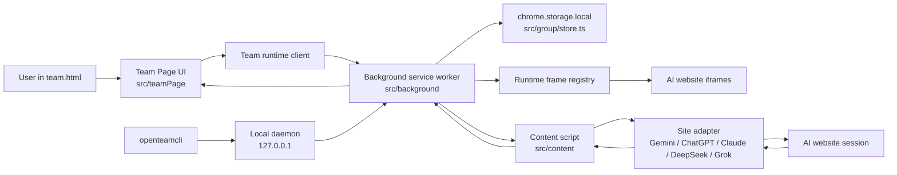
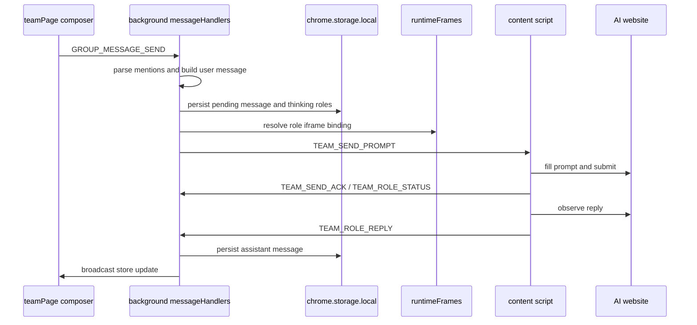
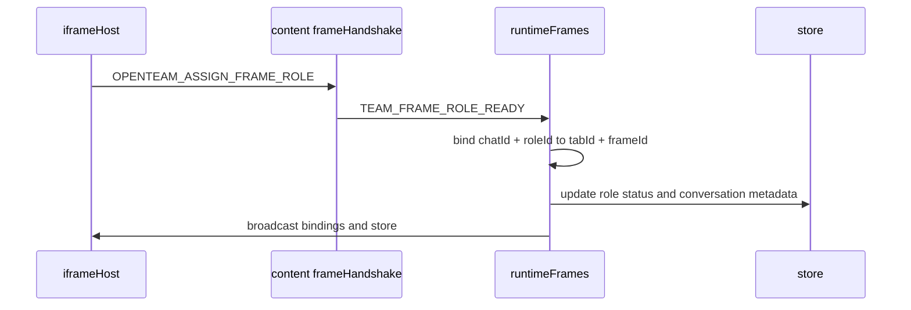
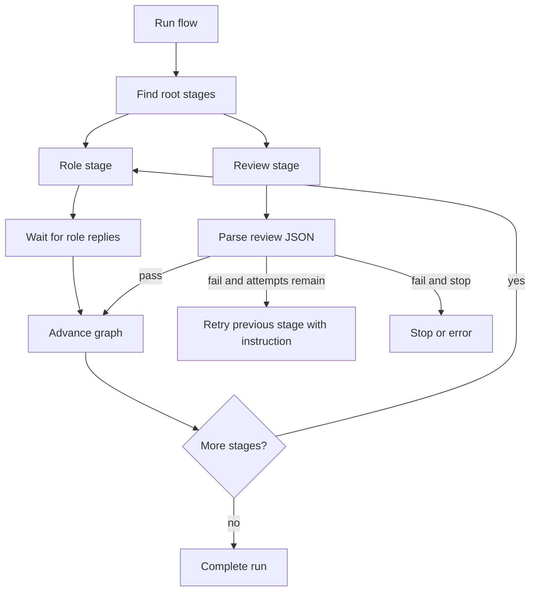
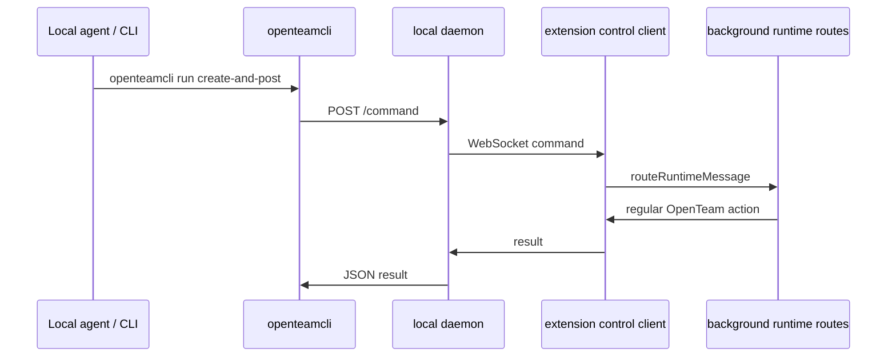

# OpenTeam Design

**Language:** English | [简体中文](DESIGN.zh-CN.md)

This document is the technical map for OpenTeam. It explains the runtime architecture, the main data flows, and the responsibility of each module, with links to the files you usually want to open in an IDE.

## Product Shape

OpenTeam is a Manifest V3 Chrome extension that turns existing AI website sessions into a multi-person AI workspace. The extension does not call ChatGPT, Claude, Gemini, DeepSeek, or Grok web models through their model APIs. Instead, it embeds supported AI web pages, sends prompts through content scripts, observes the generated replies, and persists the resulting team conversation locally.

The system has three first-class surfaces:

- Extension workspace: [public/team.html](../public/team.html), [public/team.css](../public/team.css), and [src/teamPage/index.ts](../src/teamPage/index.ts).
- Background runtime: [src/background/index.ts](../src/background/index.ts).
- AI-site content script: [src/content/index.ts](../src/content/index.ts).

An optional local control path lets external agents operate OpenTeam through [packages/openteamcli/openteamcli.mjs](../packages/openteamcli/openteamcli.mjs) and [packages/openteamcli/openteam-daemon.mjs](../packages/openteamcli/openteam-daemon.mjs).

## Architecture

The extension uses Chrome runtime messages for in-extension communication and `chrome.storage.local` for persistence. The local daemon uses HTTP plus a WebSocket bridge to forward agent commands to the extension.

## Runtime Flow

1. The workspace starts in [src/teamPage/index.ts](../src/teamPage/index.ts), gathers DOM references through [src/teamPage/domRefs.ts](../src/teamPage/domRefs.ts), loads state through [src/teamPage/runtimeClient.ts](../src/teamPage/runtimeClient.ts), and renders the selected chat.
2. User actions become runtime commands such as chat creation, role creation, message send, role recovery, or orchestration start.
3. [src/background/index.ts](../src/background/index.ts) registers the service worker routes through [src/background/messageRouter.ts](../src/background/messageRouter.ts).
4. Route handlers mutate the store through [src/background/storeAccess.ts](../src/background/storeAccess.ts), then broadcast the updated store through [src/background/runtimeClient.ts](../src/background/runtimeClient.ts).
5. When a prompt must go to a website-backed role, the background locates the role iframe through [src/background/runtimeFrames.ts](../src/background/runtimeFrames.ts), prepares prompt delivery, and sends `TEAM_SEND_PROMPT`.
6. [src/content/index.ts](../src/content/index.ts) receives that message, selects a site adapter from [src/content/sites/index.ts](../src/content/sites/index.ts), fills the AI page, starts reply polling, and reports replies back to the background.
7. The background stores assistant replies, advances orchestration runs when relevant, and pushes the updated store back to the workspace.

## Data Model

The canonical domain model is in [src/group/types.ts](../src/group/types.ts). The central object is `OpenTeamStore`, which contains:

- `chatsById` and `chatOrder` for chat documents.
- `rolesById` for chat-specific people.
- `messagesById` for user, assistant, and system messages.
- `roleTemplatesById` and `roleTemplateOrder` for reusable people.
- Orchestration flows and runs for graph-based multi-step work.
- Notes, highlights, external model memories, view state, and settings.

Persistence is implemented in [src/group/store.ts](../src/group/store.ts). The current storage layout splits data into:

- `openteam.meta.v2`: global metadata, settings, templates, notes, highlights, orchestration indexes.
- `openteam.chat.<chatId>`: one chat document plus its roles and message chunk ids.
- `openteam.messages.<chatId>.<chunkId>`: message chunks of `MESSAGE_CHUNK_SIZE` messages.

This split keeps large conversations from turning into one oversized storage value. `loadStore`, `saveStore`, and `updateStoreQueued` are the main persistence entry points.

## Module Map

### Extension Shell

- [public/manifest.json](../public/manifest.json): MV3 manifest, permissions, supported host permissions, content script matches, CSP, and DNR rule registration.
- [public/openteam-frame-rules.json](../public/openteam-frame-rules.json): response-header rewrite rules used to embed supported AI sites in extension iframes.
- [public/team.html](../public/team.html): workspace DOM skeleton and modal structure.
- [public/team.css](../public/team.css): full workspace styling.
- [vite.config.ts](../vite.config.ts): builds `background.js` and `team.js` with Vite, bundles `content.js` as an IIFE with esbuild, and rejects release scripts that expose source maps, top-level imports in content scripts, or dynamic code execution.

### Team Page UI

[src/teamPage/index.ts](../src/teamPage/index.ts) is the composition root. It wires DOM refs, app state, runtime messaging, and all UI modules.

Important modules:

- [src/teamPage/appState.ts](../src/teamPage/appState.ts): in-memory UI state, selected chat, drafts, panels, and local view flags.
- [src/teamPage/domRefs.ts](../src/teamPage/domRefs.ts): typed DOM lookup for all workspace elements.
- [src/teamPage/runtimeClient.ts](../src/teamPage/runtimeClient.ts): wrapper around Chrome runtime messaging and store push handling.
- [src/teamPage/chatListView.ts](../src/teamPage/chatListView.ts): chat list rendering, chat switching, duplication, export, clear, and delete actions.
- [src/teamPage/chatHeaderView.ts](../src/teamPage/chatHeaderView.ts): selected chat title, mode/status summary, and orchestration entry.
- [src/teamPage/messagesView.ts](../src/teamPage/messagesView.ts): message stream rendering, Markdown rendering, copy, quote, highlight, note capture, retry, stop, and resync actions.
- [src/teamPage/composerView.ts](../src/teamPage/composerView.ts): message composer, mention panel, references, target preview, and send behavior.
- [src/teamPage/peopleLibraryView.ts](../src/teamPage/peopleLibraryView.ts): built-in/custom person library, search, pagination, creation, editing, temporary people, and AI-generated personas.
- [src/teamPage/rolePanelView.ts](../src/teamPage/rolePanelView.ts): current chat people, role status, role recovery, and iframe focus actions.
- [src/teamPage/roleRecoveryController.ts](../src/teamPage/roleRecoveryController.ts): reconnect and recovery flow for iframe-backed roles.
- [src/teamPage/iframeHost.ts](../src/teamPage/iframeHost.ts): visible and background iframe lifecycle for AI website sessions.
- [src/teamPage/notesView.ts](../src/teamPage/notesView.ts), [src/teamPage/allNotesView.ts](../src/teamPage/allNotesView.ts), [src/teamPage/tiptapNoteEditor.ts](../src/teamPage/tiptapNoteEditor.ts): chat/global notes and rich-text editing.
- [src/teamPage/orchestrationModalView.ts](../src/teamPage/orchestrationModalView.ts), [src/teamPage/orchestrationCanvas.ts](../src/teamPage/orchestrationCanvas.ts), [src/teamPage/orchestrationStatusView.ts](../src/teamPage/orchestrationStatusView.ts): flow graph editing, review node settings, run status, and active run display.
- [src/teamPage/externalModelsView.ts](../src/teamPage/externalModelsView.ts): OpenAI-compatible and Anthropic-compatible external model configuration.
- [src/teamPage/languageController.ts](../src/teamPage/languageController.ts), [src/teamPage/themeController.ts](../src/teamPage/themeController.ts), [src/teamPage/floatingWindow.ts](../src/teamPage/floatingWindow.ts): language, theme, and floating-window behavior.

### Background Runtime

[src/background/index.ts](../src/background/index.ts) is the service worker entry point. It creates the runtime frame registry, prompt sender, external model client, control client, route handlers, and alarm-based keepalive for local agent control.

Route modules:

- [src/background/messageRouter.ts](../src/background/messageRouter.ts): type-based runtime message dispatch.
- [src/background/chatHandlers.ts](../src/background/chatHandlers.ts): chat creation, update, activation, duplication, clearing, export-oriented state, and lifecycle operations.
- [src/background/roleHandlers.ts](../src/background/roleHandlers.ts): person templates, group roles, batch role creation, recovery, reinitialization, and AI-generated personas.
- [src/background/messageHandlers.ts](../src/background/messageHandlers.ts): message send, mention target resolution, prompt preparation, stop/retry/resync, reply persistence, note save, highlight creation, runtime role status, and role errors.
- [src/background/orchestrationHandlers.ts](../src/background/orchestrationHandlers.ts): CRUD and UI commands for orchestration flows and runs.
- [src/background/orchestrationRuntime.ts](../src/background/orchestrationRuntime.ts): execution engine for graph stages, review nodes, rounds, retry decisions, run resume/stop, and run advancement after role replies.
- [src/background/externalModelHandlers.ts](../src/background/externalModelHandlers.ts): external model create/update/delete/test.
- [src/background/controlHandlers.ts](../src/background/controlHandlers.ts): translates local daemon commands into regular OpenTeam runtime actions.

Runtime support:

- [src/background/runtimeFrames.ts](../src/background/runtimeFrames.ts): maps `chatId + roleId` to `tabId + frameId` and tracks iframe readiness.
- [src/background/runtimeClient.ts](../src/background/runtimeClient.ts): broadcast store updates, remember host tabs, send UI errors, and request role recovery.
- [src/background/promptDelivery.ts](../src/background/promptDelivery.ts), [src/background/promptDeliveryRetry.ts](../src/background/promptDeliveryRetry.ts), [src/background/sitePromptDeliveryLimiter.ts](../src/background/sitePromptDeliveryLimiter.ts): prompt delivery, retry, and per-site throttling.
- [src/background/rolePromptDelivery.ts](../src/background/rolePromptDelivery.ts): prepares website-backed and external-model-backed prompt deliveries.
- [src/background/externalModelClient.ts](../src/background/externalModelClient.ts): streams OpenAI-compatible or Anthropic-compatible model responses through the AI SDK.
- [src/background/storeAccess.ts](../src/background/storeAccess.ts): common store mutation helpers and domain guards.
- [src/background/renderWake.ts](../src/background/renderWake.ts): wake/render support used by recovery and runtime reliability paths.

### Content Scripts and Site Adapters

[src/content/index.ts](../src/content/index.ts) is injected into supported AI websites. It owns the role session in the page, receives background commands, fills prompts, stops generation, reads resync content, and reports status/replies.

Supporting modules:

- [src/content/frameHandshake.ts](../src/content/frameHandshake.ts): binds a page frame to an OpenTeam `chatId` and `roleId`.
- [src/content/frameEnvironment.ts](../src/content/frameEnvironment.ts): detects iframe/direct embedding context.
- [src/content/roleSession.ts](../src/content/roleSession.ts): assigned role identity and active prompt bookkeeping.
- [src/content/conversationMonitor.ts](../src/content/conversationMonitor.ts): conversation id/url tracking.
- [src/content/replyObserver.ts](../src/content/replyObserver.ts): reply polling and stable-output detection.
- [src/content/replyTracker.ts](../src/content/replyTracker.ts), [src/content/replyCompensation.ts](../src/content/replyCompensation.ts), [src/content/replyTimeout.ts](../src/content/replyTimeout.ts): duplicate prevention, late reply recovery, and timeout behavior.
- [src/content/reportableReply.ts](../src/content/reportableReply.ts): extracts reply text that is safe and useful to report.
- [src/content/promptDelay.ts](../src/content/promptDelay.ts), [src/content/promptStatus.ts](../src/content/promptStatus.ts): input timing and status messages.
- [src/content/runtimeClient.ts](../src/content/runtimeClient.ts): content-script runtime messaging.

Site adapters share the interface in [src/content/sites/types.ts](../src/content/sites/types.ts). The adapter selector is [src/content/sites/index.ts](../src/content/sites/index.ts), with implementations in:

- [src/content/sites/gemini.ts](../src/content/sites/gemini.ts)
- [src/content/sites/chatgpt.ts](../src/content/sites/chatgpt.ts)
- [src/content/sites/claude.ts](../src/content/sites/claude.ts)
- [src/content/sites/deepseek.ts](../src/content/sites/deepseek.ts)

Adapter helpers such as [src/content/sites/contentEditable.ts](../src/content/sites/contentEditable.ts), [src/content/sites/domMarkdown.ts](../src/content/sites/domMarkdown.ts), [src/content/sites/domText.ts](../src/content/sites/domText.ts), and [src/content/sites/waitForElement.ts](../src/content/sites/waitForElement.ts) isolate DOM-specific operations.

### Group Domain Layer

The `src/group` directory is the pure domain layer shared by background and UI code.

- [src/group/types.ts](../src/group/types.ts): canonical store, chat, role, message, note, external model, and orchestration types.
- [src/group/store.ts](../src/group/store.ts): normalization, migration, chunked persistence, and queued store updates.
- [src/group/runtimeProtocol.ts](../src/group/runtimeProtocol.ts): message contracts between background and role frames.
- [src/group/roleTemplates.ts](../src/group/roleTemplates.ts): reusable templates, group role creation, updates, deletion, template usage, and batch creation.
- [src/group/builtinRoleTemplates.ts](../src/group/builtinRoleTemplates.ts): built-in advisor personas.
- [src/group/defaultCustomRoleTemplates.ts](../src/group/defaultCustomRoleTemplates.ts): default user-editable templates.
- [src/group/builtinGroupTemplates.ts](../src/group/builtinGroupTemplates.ts): ready-made chat templates.
- [src/group/mentionParser.ts](../src/group/mentionParser.ts): parses `@person`, aliases, and `@everyone` routing.
- [src/group/promptBuilder.ts](../src/group/promptBuilder.ts): independent/collaborative prompts, role initialization prompts, persona inclusion rules, references, and context blocks.
- [src/group/contextSync.ts](../src/group/contextSync.ts), [src/group/contextBudget.ts](../src/group/contextBudget.ts): unsynced context selection and context size control.
- [src/group/orchestrationTemplates.ts](../src/group/orchestrationTemplates.ts): reusable orchestration templates.
- [src/group/orchestrationAutoPlan.ts](../src/group/orchestrationAutoPlan.ts): generation and normalization of auto-planned orchestration flows.
- [src/group/orchestrationPrompts.ts](../src/group/orchestrationPrompts.ts): prompt content for orchestration role stages and review stages.
- [src/group/orchestrationReview.ts](../src/group/orchestrationReview.ts): parses structured review decisions.
- [src/group/externalModelContext.ts](../src/group/externalModelContext.ts): memory/context handling for external-model roles.
- [src/group/personaGeneration.ts](../src/group/personaGeneration.ts): prompt and parser for AI-generated person drafts.
- [src/group/conversationUrl.ts](../src/group/conversationUrl.ts): supported conversation URL and default site URL handling.
- [src/group/highlightColors.ts](../src/group/highlightColors.ts): message highlight color normalization.

### Shared Utilities

- [src/shared/i18n.ts](../src/shared/i18n.ts): UI translations, role/template localization, prompt language rules, and language normalization.
- [src/shared/logger.ts](../src/shared/logger.ts): small scoped logger used by runtime modules.

### Local Agent Control

The local control path is optional and disabled unless the user enables it in settings.

- [src/shared/localControlProtocol.ts](../src/shared/localControlProtocol.ts): protocol version, capabilities, command/result payloads, and common helpers.
- [src/background/controlClient.ts](../src/background/controlClient.ts): service worker client that connects to the local daemon.
- [src/background/controlHandlers.ts](../src/background/controlHandlers.ts): command executor for `chat.*`, `roles.batchAdd`, `task.*`, and `run.createAndPost`.
- [packages/openteamcli/openteam-daemon.mjs](../packages/openteamcli/openteam-daemon.mjs): local HTTP/WebSocket daemon on `127.0.0.1`.
- [packages/openteamcli/openteamcli.mjs](../packages/openteamcli/openteamcli.mjs): command-line wrapper that starts the daemon when needed and sends authenticated commands.
- [packages/openteamcli/skills/openteam-control/SKILL.md](../packages/openteamcli/skills/openteam-control/SKILL.md): local agent skill instructions for controlling OpenTeam.

The daemon stores an auth token at `~/.openteam/control-token`, exposes `/status`, `/logs`, `/command`, and `/shutdown`, and forwards commands to the connected extension profile.

### Tests

Tests live next to the implementation files as `*.test.ts`. The main commands are:

- `npm test`: Vitest unit tests.
- `npm run verify`: typecheck, unit tests, and build.

## Key Data Flows

### Sending a Message to Website-Backed Roles

The most useful files for this flow are [src/teamPage/composerView.ts](../src/teamPage/composerView.ts), [src/background/messageHandlers.ts](../src/background/messageHandlers.ts), [src/background/rolePromptDelivery.ts](../src/background/rolePromptDelivery.ts), [src/content/index.ts](../src/content/index.ts), and [src/content/replyObserver.ts](../src/content/replyObserver.ts).

### Role Frame Binding and Recovery

Relevant files: [src/teamPage/iframeHost.ts](../src/teamPage/iframeHost.ts), [src/content/frameHandshake.ts](../src/content/frameHandshake.ts), [src/background/runtimeFrames.ts](../src/background/runtimeFrames.ts), and [src/teamPage/roleRecoveryController.ts](../src/teamPage/roleRecoveryController.ts).

### Orchestration Runs

Relevant files: [src/background/orchestrationRuntime.ts](../src/background/orchestrationRuntime.ts), [src/background/orchestrationHandlers.ts](../src/background/orchestrationHandlers.ts), [src/teamPage/orchestrationModalView.ts](../src/teamPage/orchestrationModalView.ts), [src/teamPage/orchestrationCanvas.ts](../src/teamPage/orchestrationCanvas.ts), [src/group/orchestrationPrompts.ts](../src/group/orchestrationPrompts.ts), and [src/group/orchestrationReview.ts](../src/group/orchestrationReview.ts).

### Local Agent Command Flow

Relevant files: [packages/openteamcli/openteamcli.mjs](../packages/openteamcli/openteamcli.mjs), [packages/openteamcli/openteam-daemon.mjs](../packages/openteamcli/openteam-daemon.mjs), [src/background/controlClient.ts](../src/background/controlClient.ts), and [src/background/controlHandlers.ts](../src/background/controlHandlers.ts).

## Design Constraints

- Website-backed roles are inherently DOM-sensitive. Site adapter changes should stay isolated in `src/content/sites`.
- The background service worker is the authority for durable state. UI modules should send commands rather than directly mutating persisted data.
- `chatId + roleId` is the product identity; `tabId + frameId` is the Chrome delivery address. Keep those concepts separate.
- Prompt construction belongs in `src/group`, not in UI code, so it remains testable and shared by normal messages and orchestration.
- Large conversations must continue using chunked storage. Avoid reintroducing a single monolithic store value.
- External model support is a separate model source. Website roles and external model roles should share message semantics but keep delivery paths explicit.
- The local agent daemon must stay localhost-only and token-authenticated.
