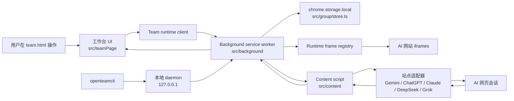
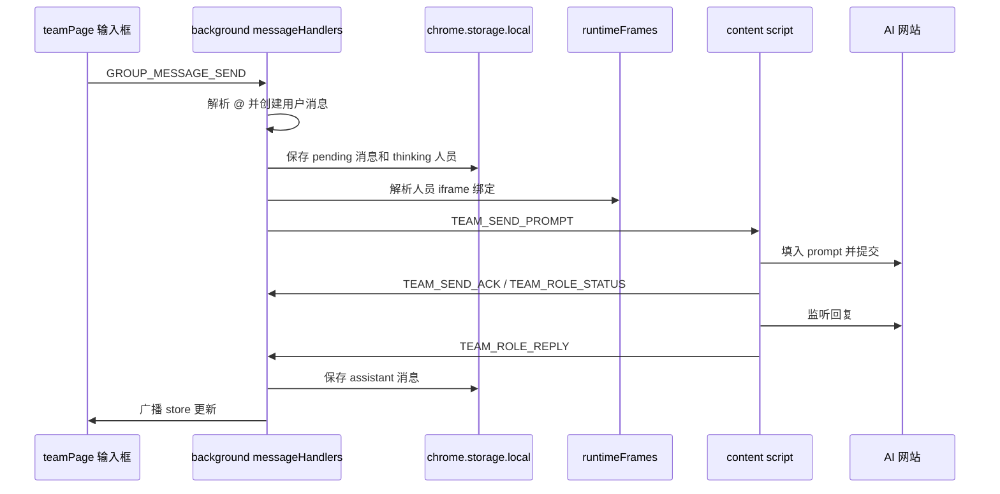
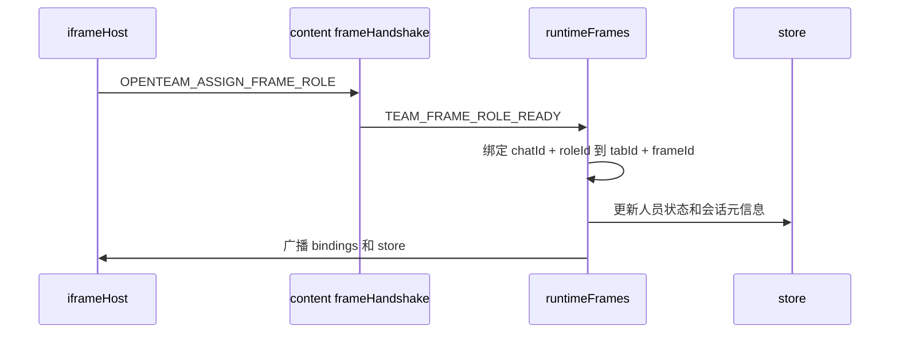
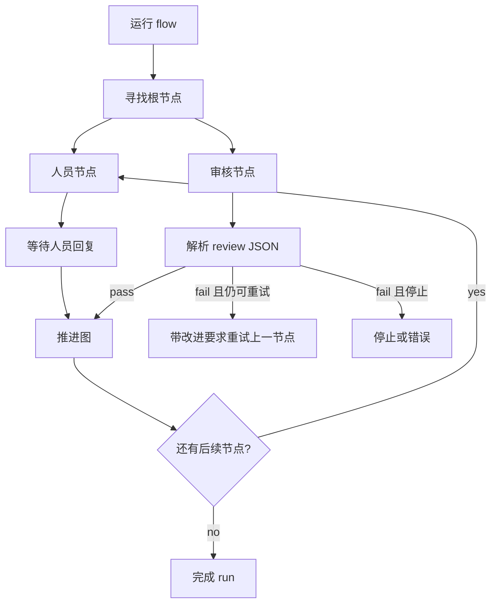
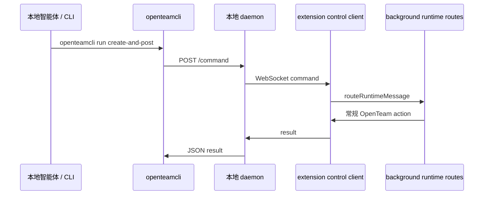

# OpenTeam 设计文档

**语言:** [English](DESIGN.md) | 简体中文

这份文档是 OpenTeam 的技术地图。它说明整体运行架构、关键数据流，以及每个模块负责什么，并尽量把模块名链接到 IDE 里最值得打开的源文件。

## 产品形态

OpenTeam 是一个 Manifest V3 Chrome 扩展，用来把已有的 AI 网页会话组织成多人 AI 工作台。它不会通过模型 API 调用 ChatGPT、Claude、Gemini、DeepSeek 或 Grok 的网页模型，而是嵌入支持的 AI 网站页面，通过 content script 发送 prompt、监听回复，并把团队讨论结果持久化到本地。

系统有三个核心界面/运行面：

- 扩展工作台：[public/team.html](../public/team.html)、[public/team.css](../public/team.css)、[src/teamPage/index.ts](../src/teamPage/index.ts)。
- 后台运行时：[src/background/index.ts](../src/background/index.ts)。
- AI 站点 content script：[src/content/index.ts](../src/content/index.ts)。

可选的本地控制链路允许外部智能体通过 [packages/openteamcli/openteamcli.mjs](../packages/openteamcli/openteamcli.mjs) 和 [packages/openteamcli/openteam-daemon.mjs](../packages/openteamcli/openteam-daemon.mjs) 操作 OpenTeam。

## 整体架构

扩展内部通过 Chrome runtime message 通信，通过 `chrome.storage.local` 做持久化。本地 daemon 使用 HTTP 加 WebSocket bridge，把智能体命令转发给扩展。

## 运行流程

1. 工作台从 [src/teamPage/index.ts](../src/teamPage/index.ts) 启动，通过 [src/teamPage/domRefs.ts](../src/teamPage/domRefs.ts) 收集 DOM 引用，通过 [src/teamPage/runtimeClient.ts](../src/teamPage/runtimeClient.ts) 加载状态并渲染当前群聊。
2. 用户操作会变成 runtime 命令，例如创建群聊、创建人员、发送消息、恢复人员或启动编排。
3. [src/background/index.ts](../src/background/index.ts) 通过 [src/background/messageRouter.ts](../src/background/messageRouter.ts) 注册 service worker 路由。
4. 路由处理器通过 [src/background/storeAccess.ts](../src/background/storeAccess.ts) 修改 store，然后通过 [src/background/runtimeClient.ts](../src/background/runtimeClient.ts) 广播最新 store。
5. 当 prompt 需要投递给网页站点人员时，background 会通过 [src/background/runtimeFrames.ts](../src/background/runtimeFrames.ts) 找到该人员 iframe，准备 prompt delivery，并发送 `TEAM_SEND_PROMPT`。
6. [src/content/index.ts](../src/content/index.ts) 收到消息后，从 [src/content/sites/index.ts](../src/content/sites/index.ts) 选择站点适配器，填入 AI 页面、开始监听回复，并把回复上报给 background。
7. background 保存 assistant 回复，必要时推进编排运行，然后把更新后的 store 推回工作台。

## 数据模型

核心领域模型在 [src/group/types.ts](../src/group/types.ts)。中心对象是 `OpenTeamStore`，主要包含：

- `chatsById` 和 `chatOrder`：群聊文档。
- `rolesById`：某个群聊里的人员实例。
- `messagesById`：用户消息、AI 回复和系统消息。
- `roleTemplatesById` 和 `roleTemplateOrder`：可复用人员模板。
- 编排 flow 和 run：图形化多步骤任务。
- 笔记、高亮、外部模型记忆、视图状态和设置。

持久化由 [src/group/store.ts](../src/group/store.ts) 实现。当前存储结构拆成：

- `openteam.meta.v2`：全局元数据、设置、模板、笔记、高亮、编排索引。
- `openteam.chat.<chatId>`：单个群聊文档、人员和消息 chunk id。
- `openteam.messages.<chatId>.<chunkId>`：按 `MESSAGE_CHUNK_SIZE` 切分的消息块。

这样可以避免长对话变成一个过大的 storage value。主要入口是 `loadStore`、`saveStore` 和 `updateStoreQueued`。

## 模块地图

### 扩展外壳

- [public/manifest.json](../public/manifest.json)：MV3 manifest、权限、host permissions、content script matches、CSP 和 DNR 规则注册。
- [public/openteam-frame-rules.json](../public/openteam-frame-rules.json)：用于把支持的 AI 网站嵌入扩展 iframe 的响应头改写规则。
- [public/team.html](../public/team.html)：工作台 DOM 骨架和弹窗结构。
- [public/team.css](../public/team.css)：工作台完整样式。
- [vite.config.ts](../vite.config.ts)：用 Vite 构建 `background.js` 和 `team.js`，用 esbuild 把 `content.js` 打成 IIFE，并在发布构建中拒绝 source map、content script 顶层 import 和动态代码执行。

### 工作台 UI

[src/teamPage/index.ts](../src/teamPage/index.ts) 是 UI 组合根。它把 DOM 引用、app state、runtime messaging 和所有视图模块组装在一起。

重要模块：

- [src/teamPage/appState.ts](../src/teamPage/appState.ts)：内存 UI 状态、选中群聊、草稿、面板和本地视图标记。
- [src/teamPage/domRefs.ts](../src/teamPage/domRefs.ts)：所有工作台 DOM 元素的类型化查询。
- [src/teamPage/runtimeClient.ts](../src/teamPage/runtimeClient.ts)：Chrome runtime messaging 和 store push 的封装。
- [src/teamPage/chatListView.ts](../src/teamPage/chatListView.ts)：群聊列表渲染、切换群聊、复制、导出、清空和删除。
- [src/teamPage/chatHeaderView.ts](../src/teamPage/chatHeaderView.ts)：当前群聊标题、模式/状态摘要和编排入口。
- [src/teamPage/messagesView.ts](../src/teamPage/messagesView.ts)：消息流渲染、Markdown 渲染、复制、引用、高亮、加入笔记、重试、停止和重新同步。
- [src/teamPage/composerView.ts](../src/teamPage/composerView.ts)：输入框、@ 面板、引用、目标预览和发送行为。
- [src/teamPage/peopleLibraryView.ts](../src/teamPage/peopleLibraryView.ts)：内置/自定义人员库、搜索、分页、新建、编辑、临时人员和 AI 生成人设。
- [src/teamPage/rolePanelView.ts](../src/teamPage/rolePanelView.ts)：当前群聊人员、人员状态、恢复人员和定位 iframe。
- [src/teamPage/roleRecoveryController.ts](../src/teamPage/roleRecoveryController.ts)：iframe 人员的重连和恢复流程。
- [src/teamPage/iframeHost.ts](../src/teamPage/iframeHost.ts)：AI 网页 iframe 的可见/后台生命周期。
- [src/teamPage/notesView.ts](../src/teamPage/notesView.ts)、[src/teamPage/allNotesView.ts](../src/teamPage/allNotesView.ts)、[src/teamPage/tiptapNoteEditor.ts](../src/teamPage/tiptapNoteEditor.ts)：群聊/全局笔记和富文本编辑。
- [src/teamPage/orchestrationModalView.ts](../src/teamPage/orchestrationModalView.ts)、[src/teamPage/orchestrationCanvas.ts](../src/teamPage/orchestrationCanvas.ts)、[src/teamPage/orchestrationStatusView.ts](../src/teamPage/orchestrationStatusView.ts)：流程图编辑、审核节点设置、运行状态和活跃 run 展示。
- [src/teamPage/externalModelsView.ts](../src/teamPage/externalModelsView.ts)：OpenAI compatible 和 Anthropic compatible 外部模型配置。
- [src/teamPage/languageController.ts](../src/teamPage/languageController.ts)、[src/teamPage/themeController.ts](../src/teamPage/themeController.ts)、[src/teamPage/floatingWindow.ts](../src/teamPage/floatingWindow.ts)：语言、主题和浮窗行为。

### 后台运行时

[src/background/index.ts](../src/background/index.ts) 是 service worker 入口。它创建 runtime frame registry、prompt sender、external model client、control client、各类路由处理器，以及本地智能体控制的 alarm keepalive。

路由模块：

- [src/background/messageRouter.ts](../src/background/messageRouter.ts)：按 `type` 分发 runtime message。
- [src/background/chatHandlers.ts](../src/background/chatHandlers.ts)：群聊创建、更新、激活、复制、清空、导出相关状态和生命周期操作。
- [src/background/roleHandlers.ts](../src/background/roleHandlers.ts)：人员模板、群聊人员、批量创建、恢复、重新初始化和 AI 生成人设。
- [src/background/messageHandlers.ts](../src/background/messageHandlers.ts)：发送消息、解析 @ 目标、准备 prompt、停止/重试/重同步、保存回复、保存笔记、创建高亮、runtime 人员状态和人员错误。
- [src/background/orchestrationHandlers.ts](../src/background/orchestrationHandlers.ts)：编排 flow 和 run 的 CRUD 与 UI 命令。
- [src/background/orchestrationRuntime.ts](../src/background/orchestrationRuntime.ts)：图节点执行引擎、审核节点、轮次、重试决策、继续/停止 run，以及人员回复后的推进逻辑。
- [src/background/externalModelHandlers.ts](../src/background/externalModelHandlers.ts)：外部模型创建、更新、删除和测试。
- [src/background/controlHandlers.ts](../src/background/controlHandlers.ts)：把本地 daemon 命令翻译成常规 OpenTeam runtime action。

运行时支撑模块：

- [src/background/runtimeFrames.ts](../src/background/runtimeFrames.ts)：把 `chatId + roleId` 映射到 `tabId + frameId`，并跟踪 iframe ready 状态。
- [src/background/runtimeClient.ts](../src/background/runtimeClient.ts)：广播 store 更新、记住 host tab、发送 UI 错误和请求人员恢复。
- [src/background/promptDelivery.ts](../src/background/promptDelivery.ts)、[src/background/promptDeliveryRetry.ts](../src/background/promptDeliveryRetry.ts)、[src/background/sitePromptDeliveryLimiter.ts](../src/background/sitePromptDeliveryLimiter.ts)：prompt 投递、重试和按站点限流。
- [src/background/rolePromptDelivery.ts](../src/background/rolePromptDelivery.ts)：准备网页人员和外部模型人员的 prompt delivery。
- [src/background/externalModelClient.ts](../src/background/externalModelClient.ts)：通过 AI SDK 流式调用 OpenAI compatible 或 Anthropic compatible 模型。
- [src/background/storeAccess.ts](../src/background/storeAccess.ts)：通用 store mutation helper 和领域 guard。
- [src/background/renderWake.ts](../src/background/renderWake.ts)：恢复和运行可靠性路径中使用的 wake/render 支撑。

### Content Scripts 与站点适配器

[src/content/index.ts](../src/content/index.ts) 会注入到支持的 AI 网站。它维护页面里的人员会话，接收 background 命令，填入 prompt，停止生成，读取重新同步内容，并上报状态和回复。

支撑模块：

- [src/content/frameHandshake.ts](../src/content/frameHandshake.ts)：把页面 frame 绑定到 OpenTeam 的 `chatId` 和 `roleId`。
- [src/content/frameEnvironment.ts](../src/content/frameEnvironment.ts)：检测 iframe / direct embedded 环境。
- [src/content/roleSession.ts](../src/content/roleSession.ts)：分配到当前页面的人员身份和活跃 prompt 记录。
- [src/content/conversationMonitor.ts](../src/content/conversationMonitor.ts)：会话 id / url 跟踪。
- [src/content/replyObserver.ts](../src/content/replyObserver.ts)：回复轮询和稳定输出检测。
- [src/content/replyTracker.ts](../src/content/replyTracker.ts)、[src/content/replyCompensation.ts](../src/content/replyCompensation.ts)、[src/content/replyTimeout.ts](../src/content/replyTimeout.ts)：去重、迟到回复补偿和超时行为。
- [src/content/reportableReply.ts](../src/content/reportableReply.ts)：提取适合上报的回复文本。
- [src/content/promptDelay.ts](../src/content/promptDelay.ts)、[src/content/promptStatus.ts](../src/content/promptStatus.ts)：输入时序和状态消息。
- [src/content/runtimeClient.ts](../src/content/runtimeClient.ts)：content script 的 runtime messaging 封装。

站点适配器共享 [src/content/sites/types.ts](../src/content/sites/types.ts) 中的接口。[src/content/sites/index.ts](../src/content/sites/index.ts) 负责选择适配器，具体实现包括：

- [src/content/sites/gemini.ts](../src/content/sites/gemini.ts)
- [src/content/sites/chatgpt.ts](../src/content/sites/chatgpt.ts)
- [src/content/sites/claude.ts](../src/content/sites/claude.ts)
- [src/content/sites/deepseek.ts](../src/content/sites/deepseek.ts)

[src/content/sites/contentEditable.ts](../src/content/sites/contentEditable.ts)、[src/content/sites/domMarkdown.ts](../src/content/sites/domMarkdown.ts)、[src/content/sites/domText.ts](../src/content/sites/domText.ts)、[src/content/sites/waitForElement.ts](../src/content/sites/waitForElement.ts) 等 helper 用来隔离 DOM 细节。

### 群聊领域层

`src/group` 是 background 和 UI 共享的领域层。

- [src/group/types.ts](../src/group/types.ts)：store、群聊、人员、消息、笔记、外部模型和编排类型。
- [src/group/store.ts](../src/group/store.ts)：数据规范化、迁移、分片持久化和 queued store update。
- [src/group/runtimeProtocol.ts](../src/group/runtimeProtocol.ts)：background 和人员 frame 之间的消息协议。
- [src/group/roleTemplates.ts](../src/group/roleTemplates.ts)：可复用模板、群聊人员创建、更新、删除、模板使用情况和批量创建。
- [src/group/builtinRoleTemplates.ts](../src/group/builtinRoleTemplates.ts)：内置顾问人设。
- [src/group/defaultCustomRoleTemplates.ts](../src/group/defaultCustomRoleTemplates.ts)：默认可编辑人员模板。
- [src/group/builtinGroupTemplates.ts](../src/group/builtinGroupTemplates.ts)：现成群聊模板。
- [src/group/mentionParser.ts](../src/group/mentionParser.ts)：解析 `@人员`、别名和 `@所有人` 路由。
- [src/group/promptBuilder.ts](../src/group/promptBuilder.ts)：独立/协作 prompt、人员初始化 prompt、人设注入规则、引用和上下文块。
- [src/group/contextSync.ts](../src/group/contextSync.ts)、[src/group/contextBudget.ts](../src/group/contextBudget.ts)：未同步上下文选择和上下文长度控制。
- [src/group/orchestrationTemplates.ts](../src/group/orchestrationTemplates.ts)：可复用编排模板。
- [src/group/orchestrationAutoPlan.ts](../src/group/orchestrationAutoPlan.ts)：自动规划编排 flow 的生成和规范化。
- [src/group/orchestrationPrompts.ts](../src/group/orchestrationPrompts.ts)：编排人员节点和审核节点的 prompt 内容。
- [src/group/orchestrationReview.ts](../src/group/orchestrationReview.ts)：解析结构化审核决策。
- [src/group/externalModelContext.ts](../src/group/externalModelContext.ts)：外部模型人员的记忆和上下文处理。
- [src/group/personaGeneration.ts](../src/group/personaGeneration.ts)：AI 生成人员草稿的 prompt 和 parser。
- [src/group/conversationUrl.ts](../src/group/conversationUrl.ts)：支持的会话 URL 和默认站点 URL 处理。
- [src/group/highlightColors.ts](../src/group/highlightColors.ts)：消息高亮颜色规范化。

### Shared 工具

- [src/shared/i18n.ts](../src/shared/i18n.ts)：UI 翻译、人员/模板本地化、prompt 语言规则和语言规范化。
- [src/shared/logger.ts](../src/shared/logger.ts)：运行时模块使用的小型 scoped logger。

### 本地智能体控制

本地控制链路是可选能力，只有用户在设置里开启后才会使用。

- [src/shared/localControlProtocol.ts](../src/shared/localControlProtocol.ts)：协议版本、能力列表、命令/结果 payload 和通用 helper。
- [src/background/controlClient.ts](../src/background/controlClient.ts)：service worker 侧连接本地 daemon 的客户端。
- [src/background/controlHandlers.ts](../src/background/controlHandlers.ts)：`chat.*`、`roles.batchAdd`、`task.*`、`run.createAndPost` 的命令执行器。
- [packages/openteamcli/openteam-daemon.mjs](../packages/openteamcli/openteam-daemon.mjs)：运行在 `127.0.0.1` 的本地 HTTP/WebSocket daemon。
- [packages/openteamcli/openteamcli.mjs](../packages/openteamcli/openteamcli.mjs)：命令行入口，必要时启动 daemon，并发送带认证的命令。
- [packages/openteamcli/skills/openteam-control/SKILL.md](../packages/openteamcli/skills/openteam-control/SKILL.md)：供本地智能体控制 OpenTeam 的 skill 说明。

daemon 会把认证 token 存在 `~/.openteam/control-token`，并提供 `/status`、`/logs`、`/command` 和 `/shutdown`，再把命令转发给已连接的扩展 profile。

### 测试

测试通常和实现文件放在同一目录，命名为 `*.test.ts`。主要命令：

- `npm test`：Vitest 单元测试。
- `npm run verify`：类型检查、单元测试和构建。

## 关键数据流

### 发送消息给网页站点人员

这个流程最值得看的文件是 [src/teamPage/composerView.ts](../src/teamPage/composerView.ts)、[src/background/messageHandlers.ts](../src/background/messageHandlers.ts)、[src/background/rolePromptDelivery.ts](../src/background/rolePromptDelivery.ts)、[src/content/index.ts](../src/content/index.ts) 和 [src/content/replyObserver.ts](../src/content/replyObserver.ts)。

### 人员 Frame 绑定与恢复

相关文件：[src/teamPage/iframeHost.ts](../src/teamPage/iframeHost.ts)、[src/content/frameHandshake.ts](../src/content/frameHandshake.ts)、[src/background/runtimeFrames.ts](../src/background/runtimeFrames.ts)、[src/teamPage/roleRecoveryController.ts](../src/teamPage/roleRecoveryController.ts)。

### 编排运行

相关文件：[src/background/orchestrationRuntime.ts](../src/background/orchestrationRuntime.ts)、[src/background/orchestrationHandlers.ts](../src/background/orchestrationHandlers.ts)、[src/teamPage/orchestrationModalView.ts](../src/teamPage/orchestrationModalView.ts)、[src/teamPage/orchestrationCanvas.ts](../src/teamPage/orchestrationCanvas.ts)、[src/group/orchestrationPrompts.ts](../src/group/orchestrationPrompts.ts)、[src/group/orchestrationReview.ts](../src/group/orchestrationReview.ts)。

### 本地智能体命令流

相关文件：[packages/openteamcli/openteamcli.mjs](../packages/openteamcli/openteamcli.mjs)、[packages/openteamcli/openteam-daemon.mjs](../packages/openteamcli/openteam-daemon.mjs)、[src/background/controlClient.ts](../src/background/controlClient.ts)、[src/background/controlHandlers.ts](../src/background/controlHandlers.ts)。

## 设计约束

- 网页站点人员天然依赖 DOM。站点改动应尽量隔离在 `src/content/sites`。
- background service worker 是持久化状态权威。UI 模块应该发送命令，而不是直接修改持久化数据。
- `chatId + roleId` 是产品身份；`tabId + frameId` 是 Chrome 投递地址。两者要保持分离。
- prompt 构建属于 `src/group`，不应散落在 UI 代码里，这样普通消息和编排都能复用且可测试。
- 长对话必须继续使用分片存储，避免重新变成单个巨大 store value。
- 外部模型是一条独立的 model source。网页人员和外部模型人员应该共享消息语义，但投递路径要保持清晰。
- 本地智能体 daemon 必须保持 localhost-only，并使用 token 鉴权。
