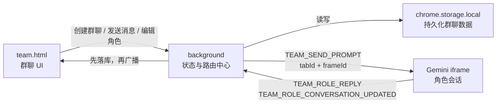

# OpenTeam 群聊功能技术方案

## 1. 目标

本文档描述 OpenTeam 群聊功能的技术实现方案，覆盖：

- 多群聊本地持久化
- 群聊角色实例建模
- Gemini iframe 会话绑定与恢复
- background 消息路由
- Team 页面打开期间活跃/隐藏 iframe 的消息落库
- 独立专家模式与协作群聊模式的 prompt 构造
- 协作模式上下文增量同步
- 引用消息
- 角色忙碌状态与发送限制
- Tailwind CSS 群聊界面实现规范

对应产品文档：

```text
docs/prd/2026-04-30-group-chat-prd.md
```

## 2. 总体架构

系统分为三层：

```text
team.html / team.js
  - 群聊列表
  - 当前群聊消息流
  - 右侧角色列表和配置面板
  - 输入框、@ 选择器、引用状态
  - iframe DOM 生命周期管理

background service worker
  - 读取和写入 chrome.storage.local
  - 维护运行态 frame 绑定
  - 解析消息目标
  - 构造 prompt
  - 向指定 iframe 投递消息
  - 接收角色回复并先落库

Gemini iframe content script
  - 接收角色绑定消息
  - 注册 frameId
  - 填入 Gemini 输入框并发送
  - 监听 Gemini 回复
  - 上报回复内容和当前 Gemini URL
```

数据流总览：



核心原则：

```text
用户可见数据全部持久化到 chrome.storage.local。
tabId / frameId 只作为运行态投递地址，不作为恢复依据。
角色恢复依赖 chatId + roleId + geminiConversationUrl。
background 收到任何带 chatId/roleId 的关键上报时，先写本地，再通知 UI。
关闭 team.html 后，页面内 Gemini iframe 随页面关闭，background 不再期望收到这些 iframe 的回复。
```

## 3. UI 技术方案

群聊页面必须使用 Tailwind CSS 实现，不再使用大量原生 CSS 手写样式。

推荐方案：

- `team.html` 只保留根节点和脚本入口。
- `src/teamPage/index.ts` 负责组装页面。
- Tailwind 通过项目构建流程产出 `public/team.css` 或打包进 team page bundle。
- 页面组件使用 Tailwind utility class，必要时用少量组件级 class，但不回到大块原生 CSS。

视觉目标：

- 整体是专业级 AI 工作台，不做普通插件弹窗质感。
- 左侧群聊列表类似微信/Slack，但风格更精致。
- 中间消息区强调清晰阅读、引用关系、角色身份。
- 右侧角色配置区强调可编辑、可诊断、可恢复。
- iframe 宿主区默认不裸露给用户，只在调试/恢复状态下显示必要信息。

建议风格：

```text
深浅都可支持，第一版优先做深色高质感工作台。
背景使用克制的玻璃感和层次，不使用廉价大渐变。
主色控制在 1-2 个品牌色，角色使用小色块区分。
消息气泡不要过圆，推荐 8-12px radius。
按钮、输入框、角色卡片、引用条都需要 hover / active / disabled 状态。
```

第一版页面结构：

```text
左侧：群聊列表 + 新建群聊按钮
中间：群聊标题 + 消息流 + 引用状态 + 输入框 + @ 弹层
右侧：角色列表 + 当前角色配置 + 状态诊断 + 恢复按钮
隐藏区：每个角色对应的 Gemini iframe 宿主
```

UI 关键要求：

- 角色 `thinking` 时，输入区需要显示哪些角色正在回复。
- 如果本次目标角色里有人 `thinking`，发送按钮 disabled。
- 引用消息时，输入框上方显示被引用角色和内容摘要。
- @ 输入时弹出角色列表，支持键盘上下选择和回车确认。
- iframe 恢复失败时，角色卡片展示错误状态和恢复按钮。

## 4. 数据模型

### 4.1 Store 根结构

`chrome.storage.local` 中建议使用一个根 key：

```ts
const STORE_KEY = 'openteam.groupStore'
```

结构：

```ts
interface OpenTeamStore {
  version: number
  currentChatId?: string
  chatOrder: string[]
  chatsById: Record<string, GroupChat>
  rolesById: Record<string, GroupRole>
  messagesById: Record<string, GroupMessage>
  roleTemplateOrder: string[]
  roleTemplatesById: Record<string, RoleTemplate>
  settings: OpenTeamSettings
}

interface OpenTeamSettings {
  defaultMode: RoomMode
  maxContextChars: number
}
```

设计理由：

- `chatOrder` 用于左侧群聊列表排序。
- `chatsById` 保存群聊元信息。
- `rolesById` 统一保存所有群聊角色实例。
- `messagesById` 统一保存全部群聊消息。
- `roleTemplateOrder` / `roleTemplatesById` 保存第一版必须支持的角色模板库。
- `currentChatId` 让插件重新打开时恢复上次群聊。
- `version` 用于后续数据迁移。

### 4.2 群聊

```ts
type RoomMode = 'independent' | 'collaborative'

interface GroupChat {
  id: string
  name: string
  mode: RoomMode
  roleIds: string[]
  messageIds: string[]
  nextMessageSeq: number
  status: 'draft' | 'initializing' | 'ready' | 'running' | 'error'
  createdAt: number
  updatedAt: number
}
```

说明：

- 一个用户可以创建多个群聊。
- 一个群聊包含多个角色实例。
- `nextMessageSeq` 是该群聊内消息递增序号。
- `messageIds` 保持消息顺序。

### 4.3 角色模板

第一版必须支持角色模板库。模板用于复用角色设定，加入群聊后生成独立 `GroupRole` 实例；模板后续修改不自动影响已加入群聊的角色实例，第一版可以不做同步。

```ts
interface RoleTemplate {
  id: string
  name: string
  description?: string
  systemPrompt: string
  createdAt: number
  updatedAt: number
}
```

角色模板与群聊角色实例使用不同 ID。`GroupRole.templateId` 只用于追溯来源，不作为路由依据。

### 4.4 角色实例

```ts
interface GroupRole {
  id: string
  chatId: string
  templateId?: string
  name: string
  description?: string
  systemPrompt?: string
  status: RoleStatus
  contextCursor: number
  geminiConversationId?: string
  geminiConversationUrl?: string
  lastPromptMessageId?: string
  lastReplyAt?: number
  createdAt: number
  updatedAt: number
}

type RoleStatus =
  | 'pending'
  | 'loading'
  | 'ready'
  | 'thinking'
  | 'error'
```

关键点：

- `GroupRole` 是群聊内角色实例，不是全局角色模板。
- 同一个“工程师”模板可以在多个群聊中生成多个角色实例。
- 路由和持久化必须使用 `chatId + roleId`。
- `contextCursor` 用于协作模式下的上下文增量同步。
- `geminiConversationUrl` 用于恢复该角色对应的 Gemini 会话，持久化和恢复时只接受 `https://gemini.google.com/` 开头的 URL。
- `lastReplyAt` 记录最近一次回复时间。
- `tabId` 和 `frameId` 不存入 `GroupRole`，只在运行态表中维护。
- 业务上只有 `status === 'ready'` 才表示可发送。

### 4.5 消息

```ts
interface GroupMessage {
  id: string
  chatId: string
  seq: number
  type: 'user' | 'assistant' | 'system'
  content: string
  roleId?: string
  roleName?: string
  targetRoleIds?: string[]
  references?: MessageReference[]
  createdAt: number
  status: 'pending' | 'sent' | 'received' | 'error'
  deliveryStatus?: Record<string, DeliveryStatus>
}

type DeliveryStatus = 'pending' | 'sent' | 'received' | 'error'

interface MessageReference {
  messageId: string
  roleId?: string
  roleName?: string
  contentSnapshot: string
}
```

说明：

- 用户消息和角色回复都进入同一个消息流。
- `type: 'user'` 表示用户自己发出的消息。
- `type: 'assistant'` 表示 AI 回复，也就是某个群聊角色回复。
- `roleId` / `roleName` 用于说明是哪一个 AI 角色回复。
- `type: 'system'` 不是必须的聊天类型，只用于内部状态提示，例如“角色恢复失败”“上下文过长被截断”。如果第一版不需要在消息流展示系统提示，可以先不创建 system message。
- `seq` 是群聊内递增序号，用于上下文同步。
- `targetRoleIds` 记录这条用户消息投递给哪些角色。
- `deliveryStatus` 记录每个目标角色的投递结果。
- 引用使用 `contentSnapshot`，避免原消息后续变化影响已发送 prompt。

### 4.6 运行态 frame 绑定

运行态绑定只存在于 background 内存中：

```ts
interface RuntimeFrameBinding {
  chatId: string
  roleId: string
  tabId: number
  frameId: number
  ready: boolean
  lastSeenAt: number
}

type RuntimeFrameBindingKey = `${chatId}:${roleId}`
```

用途：

- 向指定 Gemini iframe 发送消息。
- 根据 `sender.tab.id + sender.frameId` 反查角色。

`frameId` 说明：

```text
tabId 是浏览器标签页 ID。
frameId 是 Chrome 给这个标签页内每个 frame 分配的 ID。
顶层页面通常是 frameId = 0。
页面里的每个 iframe 都会有自己的 frameId。
```

在 OpenTeam 里，`team.html` 是一个 tab，里面会有多个 Gemini iframe。每个 Gemini iframe 都是一个独立 frame，所以 background 向 Gemini content script 发消息时，不能只知道 `tabId`，还必须指定 `frameId`，否则消息可能发到顶层 team.html 或错误的 iframe。

`chatId` 和 `roleId` 在初始化时就能拿到。流程是：

```text
team.html 创建 iframe 前，已经知道当前 chatId 和 roleId。
team.html 把 chatId / roleId 写入 iframe.dataset。
iframe 加载完成后，team.html 通过 postMessage 把 chatId / roleId 发给 iframe 内的 content script。
content script 再通过 chrome.runtime.sendMessage 上报给 background。
background 从 sender 里拿到 tabId / frameId。
最终建立 chatId + roleId -> tabId + frameId。
```

所以绑定不是等 Gemini 自己告诉我们属于哪个群聊，而是 OpenTeam 在初始化 iframe 时主动指定 `chatId + roleId`，Chrome 只负责补齐运行态投递地址 `tabId + frameId`。

反向索引：

```ts
type RuntimeFrameAddressKey = `${tabId}:${frameId}`
```

background 需要维护：

```ts
bindingByRoleKey: Map<RuntimeFrameBindingKey, RuntimeFrameBinding>
roleKeyByFrameAddress: Map<RuntimeFrameAddressKey, RuntimeFrameBindingKey>
```

### 4.7 关键关联关系

群聊、角色、iframe、Gemini 会话的关系必须分清：

```text
GroupChat(id = chatId)
  -> GroupRole(id = roleId, chatId)
    -> RuntimeFrameBinding(chatId, roleId, tabId, frameId)
    -> Gemini conversation(geminiConversationId, geminiConversationUrl)
```

约束：

- `roleId` 是群聊内角色实例 ID，可以被不同群聊复用同一个模板生成，但实例本身必须独立。
- 业务路由主键统一使用 `chatId + roleId`。
- `tabId + frameId` 只能表示当前打开着的 iframe，刷新或重新打开后会变化。
- `geminiConversationUrl` 是恢复依据，必须持久化。
- `geminiConversationId` 从 URL 中提取，用于诊断、展示和后续恢复校验。
- 后续如果需要支持同一个角色实例多开窗口，需要把运行态 key 扩展为 `chatId + roleId + instanceId`，第一版不支持多开。

## 5. Storage 设计

### 5.1 读写封装

新增模块：

```text
src/group/store.ts
```

职责：

- `loadStore()`
- `saveStore(store)`
- `updateStore(mutator)`
- 默认 store 初始化
- 版本迁移

建议所有 background 状态修改都通过串行化的 `updateStoreQueued()`。MV3 service worker 和多个角色 iframe 可能几乎同时上报回复，如果并发执行 `load -> mutate -> save`，后写入可能覆盖先写入。第一版必须加入 storage write queue / mutex，让所有 background store 写入串行化。

```ts
let storeQueue = Promise.resolve()

function updateStoreQueued<T>(mutator: (draft: OpenTeamStore) => T): Promise<T> {
  const run = async () => {
    const store = await loadStore()
    const result = mutator(store)
    await saveStore(store)
    return result
  }

  const next = storeQueue.then(run, run)
  storeQueue = next.then(() => undefined, () => undefined)
  return next
}
```

第一版可以使用简单深拷贝，不引入 Immer。

### 5.2 必须持久化

必须存：

- 群聊列表
- 当前群聊 ID
- 群聊名称和模式
- 群聊角色实例
- 角色模板库
- 角色配置
- 角色初始化 prompt
- 角色 `contextCursor`
- 角色 `geminiConversationId`
- 角色 `geminiConversationUrl`
- 消息记录
- 消息 `seq`
- 消息引用关系
- 消息投递状态

不存：

- iframe DOM
- `tabId`
- `frameId`
- 当前 Promise
- 临时 loading toast

### 5.3 写入时机

以下操作必须先写本地：

- 创建群聊
- 切换当前群聊
- 创建角色模板
- 编辑角色模板
- 创建角色
- 编辑角色
- 用户发送消息
- 角色回复
- 创建引用消息
- 更新 `contextCursor`
- 更新 Gemini 会话 URL
- 更新投递状态

特别要求：

```text
background 收到角色回复时，必须先写 chrome.storage.local，再尝试通知 team.html。
```

这样在 Team 页面打开期间，即使用户切换群聊或当前没有渲染对应消息流，消息也不会丢。关闭 team.html 后 iframe 随页面关闭，不再假设还能收到这些 iframe 的回复。

### 5.4 容量限制与后续升级

Chrome 官方文档当前说明（参考：https://developer.chrome.com/docs/extensions/reference/api/storage）：

- `chrome.storage.local` 默认上限是 10 MB。
- Chrome 113 及更早版本是 5 MB。
- 如果扩展申请 `"unlimitedStorage"` 权限，这个 `local` quota 会被忽略。
- 超过限制的写入会失败，callback 模式下设置 `runtime.lastError`，Promise 模式下 reject。
- 可以用 `chrome.storage.local.getBytesInUse()` 监控当前使用量。

对 OpenTeam 的影响：

- 第一版用 `chrome.storage.local` 可以覆盖轻量群聊记录。
- 但如果长期保存完整群聊、角色回复、引用快照、Gemini URL，10 MB 很容易被用完。
- 技术方案上建议第一版先使用 `chrome.storage.local`，同时实现容量监控。
- 第二阶段建议把大量消息正文迁移到 IndexedDB，`chrome.storage.local` 只保存索引、设置、最近消息和恢复元数据。
- 如果短期仍希望全部存在 `chrome.storage.local`，可以申请 `"unlimitedStorage"`，但仍需要做导出、清理和异常处理。

推荐策略：

```text
v1:
  chrome.storage.local 保存完整数据
  getBytesInUse 展示容量使用情况
  写入失败时给出明确错误

v2:
  IndexedDB 保存 messages
  chrome.storage.local 保存 chats / roles / settings / 最近消息索引
```

## 6. 页面恢复流程

用户点击扩展图标：

```text
background 打开 team.html
team.html 启动
team.html 请求 store snapshot
background 从 chrome.storage.local 返回 store
team.html 渲染左侧群聊列表
team.html 选择 currentChatId 或最近更新群聊
team.html 渲染当前群聊消息和角色配置
team.html 为当前群聊角色创建 iframe
iframe content script 注册 frameId
background 建立运行态绑定
角色进入 ready
```

iframe URL 选择：

```ts
const iframeUrl = isSafeGeminiUrl(role.geminiConversationUrl)
  ? role.geminiConversationUrl
  : 'https://gemini.google.com/'
```

如果 `geminiConversationUrl` 存在且以 `https://gemini.google.com/` 开头，优先打开历史 Gemini 会话；否则丢弃非法 URL，不作为 iframe src。

## 7. 群聊与角色创建流程

### 7.1 创建群聊

```text
team.html -> background: GROUP_CHAT_CREATE

payload:
  name
  mode
  roles[] // 可来自 roleTemplateId，也可直接传 name/description/systemPrompt

background:
  生成 chatId
  创建 GroupChat
  根据模板或直接输入创建独立 GroupRole[]
  写 chrome.storage.local
  返回 store snapshot

team.html:
  切换到新群聊
  渲染角色
  创建 iframe
```

### 7.2 角色模板库

```text
team.html -> background: ROLE_TEMPLATE_CREATE / ROLE_TEMPLATE_UPDATE / ROLE_TEMPLATE_DELETE

payload:
  templateId?
  name
  description
  systemPrompt
```

规则：

- 第一版必须支持创建角色模板。
- 模板字段包括 `name`、`description`、`systemPrompt`。
- 创建群聊或添加角色时，可以从模板库选择。
- 模板加入群聊后生成独立 `GroupRole` 实例，复制模板字段并记录 `templateId`。
- 模板后续修改不自动影响已加入群聊的角色实例；第一版可以不做手动同步。

### 7.3 创建角色

```text
team.html -> background: GROUP_ROLE_CREATE

payload:
  chatId
  roleTemplateId? // 从模板库选择时传入
  name?
  description?
  systemPrompt?

background:
  校验同一群聊内角色名唯一，且不含空白字符、不含 @、不是 all
  如果有 roleTemplateId，复制模板字段创建独立 GroupRole
  否则使用 payload 创建 GroupRole
  加入 chat.roleIds
  写 storage
  返回 role

team.html:
  当前群聊下创建 iframe
  新角色第一次创建 Gemini 会话时发送初始化 prompt
```

### 7.4 编辑角色

```text
team.html -> background: GROUP_ROLE_UPDATE

payload:
  chatId
  roleId
  patch
```

规则：

- 编辑角色配置只影响当前群聊里的角色实例。
- 第一版不自动重置 Gemini 会话。
- 如果用户希望新配置立即生效，提供“初始化/重新初始化”按钮，点击后向该角色当前 iframe 再发送一条初始化 prompt。
- 重新初始化回复写入群聊消息流，完成后角色进入 `ready`。

### 7.5 初始化 prompt 流程

规则：

- 新角色第一次创建 Gemini 会话时，必须发送一次初始化 prompt。
- 初始化回复需要写入群聊消息流，使用 `type: 'assistant'`，让用户能看到角色已完成初始化。
- 初始化完成后角色进入 `ready`。
- 如果已有 `geminiConversationUrl`，恢复时不自动重新初始化。
- 用户修改角色提示词后，只有点击“初始化/重新初始化”按钮才重新发送初始化 prompt；不要在编辑后自动重置会话。

## 8. iframe 绑定与 Gemini 会话恢复

### 8.1 iframe 创建

team.html 创建 iframe：

```ts
iframe.dataset.chatId = chatId
iframe.dataset.roleId = roleId
iframe.src = isSafeGeminiUrl(role.geminiConversationUrl)
  ? role.geminiConversationUrl
  : 'https://gemini.google.com/'
```

持久化和恢复 `geminiConversationUrl` 时，只接受 `https://gemini.google.com/` 开头的 URL，非法 URL 丢弃。

iframe 创建后，team.html 周期性发送绑定消息。team.html 启动、切换群聊、恢复 iframe、发送前发现 binding 缺失时，都要重新 `postMessage` 绑定：

```ts
iframe.contentWindow?.postMessage({
  type: 'OPENTEAM_ASSIGN_FRAME_ROLE',
  chatId,
  roleId,
}, '*')
```

### 8.2 content script 注册

Gemini iframe 内的 content script 收到绑定消息：

```text
OPENTEAM_ASSIGN_FRAME_ROLE
```

然后重新上报 ready，必须携带 `chatId`、`roleId` 和当前 `conversationUrl`：

```ts
chrome.runtime.sendMessage({
  type: 'TEAM_FRAME_ROLE_READY',
  chatId,
  roleId,
  conversationId,
  conversationUrl,
})
```

即使 MV3 background 重启导致内存 Map 丢失，也能通过该 ready payload 重建 `chatId + roleId -> tabId/frameId` 绑定。

background 从 sender 读取：

```ts
sender.tab.id
sender.frameId
```

建立运行态绑定：

```text
chatId:roleId -> tabId/frameId
tabId:frameId -> chatId/roleId
```

### 8.3 Gemini URL 上报

content script 需要监听 Gemini URL 变化。所有关键上报都必须携带 `chatId` 和 `roleId`，包括 `TEAM_FRAME_ROLE_READY`、`TEAM_ROLE_CONVERSATION_UPDATED`、`TEAM_ROLE_REPLY`、`TEAM_ROLE_ERROR`。

触发点：

- 初次加载
- `history.pushState`
- `history.replaceState`
- `popstate`
- 发送 prompt 后

上报：

```ts
chrome.runtime.sendMessage({
  type: 'TEAM_ROLE_CONVERSATION_UPDATED',
  chatId,
  roleId,
  conversationId,
  conversationUrl,
})
```

background 收到后：

```text
校验 conversationUrl 必须以 https://gemini.google.com/ 开头
按 chatId + roleId 更新 role.geminiConversationId / role.geminiConversationUrl
通过 updateStoreQueued 写 chrome.storage.local
```

### 8.4 恢复按钮

角色卡片提供“恢复”按钮。

点击后：

```text
读取 role.geminiConversationUrl
校验 URL 安全性，非法则改用 https://gemini.google.com/
重新创建 iframe
重新 postMessage 绑定 chatId/roleId
等待 content script 注册并重新上报 ready
更新运行态绑定
角色状态恢复 ready；已有 geminiConversationUrl 时不自动重新初始化
```

## 9. 消息发送与事件协议

### 9.1 Chrome 消息类型

第一版建议统一事件命名，避免 UI、background、content script 之间隐式耦合。

UI -> background：

```text
GROUP_STORE_GET
GROUP_CHAT_CREATE
GROUP_CHAT_SWITCH
ROLE_TEMPLATE_CREATE
ROLE_TEMPLATE_UPDATE
ROLE_TEMPLATE_DELETE
GROUP_ROLE_CREATE
GROUP_ROLE_UPDATE
GROUP_ROLE_RECOVER
GROUP_ROLE_REINITIALIZE
GROUP_MESSAGE_SEND
```

team.html -> iframe window：

```text
OPENTEAM_ASSIGN_FRAME_ROLE
```

iframe content script -> background：

```text
TEAM_FRAME_ROLE_READY
TEAM_ROLE_CONVERSATION_UPDATED
TEAM_ROLE_REPLY
TEAM_ROLE_ERROR
TEAM_SEND_ACK
```

background -> iframe content script：

```text
TEAM_SEND_PROMPT
```

background -> UI：

```text
GROUP_STORE_UPDATED
GROUP_ROLE_STATUS_UPDATED
GROUP_MESSAGE_DELIVERED
GROUP_MESSAGE_RECEIVED
GROUP_DELIVERY_ERROR
```

### 9.2 用户发送消息

用户输入：

```text
这个方案两周内上线怎么做？
```

team.html 发送：

```ts
GROUP_MESSAGE_SEND {
  chatId,
  raw,
  reference?
}
```

background：

1. 解析 `@角色`。
2. 如果没有 `@`，目标角色为当前群聊全部角色。
3. 检查所有目标角色是否 `status === 'ready'`，且存在 ready frame binding。
4. 只要有一个目标角色不可用，整次发送阻止，不创建 user message。
5. 创建 user message，初始 `deliveryStatus` 为 `pending`。
6. 写 storage。
7. 对每个目标角色构造 prompt。
8. 投递到对应 iframe。
9. content script 完成输入并触发 Gemini 发送后返回 ACK。
10. background 收到 ACK 后，才把对应 `deliveryStatus` 标为 `sent`，并推进该角色 `contextCursor`。

### 9.3 忙碌状态检查

发送前必须检查所有目标角色：

```text
status === ready
存在 ready frame binding
```

不允许向 `thinking`、`loading`、`error` 角色发送；如果缺少 ready frame binding，也视为不可用。只要任一目标角色不可用，就阻止整次发送，并提示不可用角色列表，不创建 user message。

原因：

- 避免同一个 Gemini 会话内 prompt 交错。
- 避免用户误以为所有角色都收到消息。
- 避免 user message 已创建但完全无法投递。

建议状态流转：

```text
pending -> loading -> ready -> thinking -> ready
                         \-> error
```

发送前判断：

```text
status !== ready 时禁止投递。
没有 ready frame binding 时，提示用户恢复角色/恢复聊天。
status === error 时提示用户先恢复角色/恢复聊天。
```

### 9.4 投递到 iframe

background 找运行态绑定：

```ts
const binding = bindingByRoleKey.get(`${chatId}:${roleId}`)
```

如果不存在：

- 发送前重新触发 team.html 对该 iframe `postMessage` 绑定。
- 如果仍没有 ready frame binding，标记该角色需要恢复。
- 阻止整次发送，不创建 user message，提示用户先恢复角色 iframe。

如果存在：

```ts
chrome.tabs.sendMessage(
  binding.tabId,
  {
    type: 'TEAM_SEND_PROMPT',
    chatId,
    roleId,
    messageId,
    content: prompt,
  },
  { frameId: binding.frameId }
)
```

`tabs.sendMessage` 成功只代表 Chrome 消息送达 content script，不代表 Gemini 输入和发送已完成。content script 完成输入并触发 Gemini 发送后，必须上报：

```ts
chrome.runtime.sendMessage({
  type: 'TEAM_SEND_ACK',
  chatId,
  roleId,
  messageId,
})
```

background 收到 ACK 后，才把该角色的 `deliveryStatus` 标为 `sent`，并推进该角色 `contextCursor`。

## 10. Prompt 构造

新增模块：

```text
src/group/promptBuilder.ts
```

接口：

```ts
interface BuildPromptInput {
  chat: GroupChat
  role: GroupRole
  userMessage: GroupMessage
  roles: GroupRole[]
  unsyncedMessages: GroupMessage[]
  reference?: MessageReference
}

function buildPrompt(input: BuildPromptInput): string
```

### 10.1 独立专家模式

独立模式不主动携带群聊历史。

prompt：

```text
你是「工程师」。

角色设定：
...

用户消息：
...
```

如果有引用：

```text
用户引用了「产品经理」的观点：
「...」

用户消息：
...
```

### 10.2 协作群聊模式

协作模式携带该角色尚未同步的群聊上下文。

prompt：

```text
你正在一个 AI 群聊中。

群聊成员：
- 产品经理：...
- 工程师：...
- 反方：...

你的身份是「工程师」。

你上次之后，群聊里有这些新内容：
用户：...
产品经理：...
反方：...

用户最新消息：
...

请以「工程师」身份回复。你可以参考、补充或反驳其他成员观点。
```

如果有引用，引用内容放在上下文之后、用户最新消息之前，并明确要求回应。

## 11. 协作模式上下文同步

新增模块：

```text
src/group/contextSync.ts
```

核心函数：

```ts
function getUnsyncedMessagesForRole(
  chat: GroupChat,
  role: GroupRole,
  messages: GroupMessage[],
  userMessage: GroupMessage,
): GroupMessage[]
```

逻辑：

```ts
messages.filter(message =>
  message.seq > role.contextCursor &&
  message.id !== userMessage.id &&
  message.roleId !== role.id
)
```

content script ACK 成功后：

```ts
role.contextCursor = chat.nextMessageSeq - 1
```

发送失败：

```text
不更新 contextCursor
```

长度兜底：

```text
maxContextChars = 6000
```

如果未同步上下文超过限制，第一版采用截断策略：

- 只发送最新 `maxContextChars` 字符，默认 6000 字。
- 从较早消息开始截断。
- prompt 中明确说明“部分早期上下文已省略”。
- content script 返回 ACK 后，`contextCursor` 推进到当前最新消息序号。
- 第一版接受被截断的旧上下文不再逐条补发，后续版本再考虑摘要。

## 12. 角色回复流程

content script 监听 Gemini 回复稳定后：

```ts
chrome.runtime.sendMessage({
  type: 'TEAM_ROLE_REPLY',
  chatId,
  roleId,
  messageId,
  content,
  conversationId,
  conversationUrl,
})
```

background：

1. 优先使用 payload 中的 `chatId + roleId` 定位角色；`sender.tab.id + sender.frameId` 只作为校验和重建绑定依据。
2. 即使 background 内存 Map 丢失，也能根据 payload 落库。
3. 校验并更新合法的 `conversationUrl`。
4. 创建 `type: 'assistant'` 的 role message。
5. 分配 `seq`。
6. 通过 `updateStoreQueued` 写 storage。
7. 将角色状态改为 `ready`，更新 `lastReplyAt`。
8. 清理 `lastPromptMessageId`。
9. 如果 team.html 打开，推送 UI 更新。

关键点：

```text
所有关键上报必须带 chatId/roleId；先写 storage，再推 UI。
```

## 13. 前台关闭、刷新与群聊切换

iframe 生命周期以当前 `team.html` 页面为边界。关闭 Team 页面后，页面内所有 Gemini iframe 直接关闭，background 不再期望收到这些 iframe 的回复。只保证 Team 页面打开期间，已激活群聊的隐藏 iframe 可以继续生成并上报回复。

场景：

- 用户切换到其他群聊。
- 某个已激活但当前未展示的群聊 iframe 仍在隐藏宿主区回复。
- 用户刷新或关闭 team.html，所有 iframe 生命周期结束。
- service worker 重启后，content script 重新上报 ready 或 reply。

处理规则：

```text
Team 页面打开期间，活跃群聊 iframe 保留在隐藏宿主区，切换群聊不销毁。
任何带 chatId/roleId 的 TEAM_ROLE_REPLY / TEAM_ROLE_CONVERSATION_UPDATED 都必须先写 chrome.storage.local。
如果当前有 team.html 连接，再广播 store snapshot 或增量事件。
如果 team.html 已关闭，不假设旧 iframe 仍会继续回复。
页面刷新/关闭后需要按恢复流程重新创建 iframe。
```

team.html 重新打开后：

```text
重新 loadStore
渲染本地消息
恢复当前群聊 iframe
如用户切换到没有活跃 iframe 的群聊，展示“恢复聊天”按钮
点击后按该群聊角色的 geminiConversationUrl 重新创建 iframe
```

这意味着 UI 不是数据真相来源。UI 可以随时关闭、重建、切换群聊；真实用户可见数据以 `chrome.storage.local` 为准，但运行态 iframe 只在当前 Team 页面生命周期内有效。

## 14. @ 解析

新增模块：

```text
src/group/mentionParser.ts
```

规则：

```text
无 @：目标为当前群聊全部角色
@A：目标为 A
@A @B：目标为 A 和 B
@all：兼容为全部角色，但 UI 不主动展示
```

第一版限制：

- 同一群聊内角色名必须唯一。
- 角色名不能包含空白字符。
- 角色名不能包含 `@`。
- 角色名不能是 `all`（大小写不敏感），避免与 `@all` 冲突。
- 手写 `@` 解析采用最长匹配，解决“产品”和“产品经理”同时存在时 `@产品经理` 应匹配“产品经理”的问题。

## 15. 引用消息

team.html 维护一个待发送引用：

```ts
selectedReference: MessageReference | null
```

发送时写入 user message：

```ts
message.references = selectedReference ? [selectedReference] : []
```

第一版只允许引用一条消息。

引用内容参与 prompt 构造，但引用本身也要持久化，方便刷新后显示“回复/引用了谁”。

## 16. error 与 Gemini 登录处理

第一版不做单条失败消息重试。角色进入 `error` 后，只提供“恢复角色/恢复聊天”，用户恢复后需要重新发送消息。

Gemini 未登录或输入框不可用时：

```text
content script -> background: TEAM_ROLE_ERROR
payload:
  chatId
  roleId
  messageId?
  reason: 'GEMINI_NOT_LOGGED_IN' | 'INPUT_UNAVAILABLE' | string
```

background：

- 通过 `updateStoreQueued` 将角色状态标为 `error`。
- 记录可展示错误原因。
- 不推进 `contextCursor`。
- 不把 `deliveryStatus` 标为 `sent`。

UI：

- 右侧角色卡显示“需要登录 Gemini”。
- 提供“打开 Gemini 登录页”按钮。
- 用户登录后点击“恢复角色/恢复聊天”，重新创建 iframe 并重新绑定。

## 17. 推荐模块拆分

```text
src/group/types.ts
src/group/store.ts
src/group/groupRoom.ts
src/group/roleTemplates.ts
src/group/messageRouter.ts
src/group/promptBuilder.ts
src/group/mentionParser.ts
src/group/contextSync.ts
src/group/conversationUrl.ts

src/background/index.ts
src/background/runtimeFrames.ts

src/teamPage/index.ts
src/teamPage/chatList.ts
src/teamPage/messageList.ts
src/teamPage/rolePanel.ts
src/teamPage/composer.ts
src/teamPage/iframeHost.ts

src/content/index.ts
src/content/geminiConversation.ts
```

拆分原则：

- 纯逻辑放 `src/group/`，方便单元测试。
- Chrome API 留在 background 和 content script 边界。
- UI 只负责展示和发命令，不直接修改 store。

## 18. 与当前实现的衔接

当前项目已经有 `team.html`、team page iframe 宿主、background 路由和 Gemini content script 的基础能力。群聊第一版建议在现有能力上扩展，而不是重写：

- 保留 iframe 内嵌 Gemini 的技术路线。
- 保留 content script 对 Gemini 输入和回复的自动化能力。
- 将当前单房间/单队列概念升级为多 `GroupChat`。
- 将当前 iframe 绑定从较弱的页面状态升级为 `chatId + roleId -> tabId/frameId` 的运行态绑定表。
- 将消息和角色配置从 UI 内存状态升级为 `chrome.storage.local` 持久化 store。
- 将 URL 监听作为 content script 的必备能力，用于记录 `geminiConversationUrl`。

## 19. 测试计划

### 19.1 单元测试

- 创建多个群聊。
- 创建和编辑角色模板。
- 从角色模板创建群聊角色实例。
- 创建和编辑角色实例。
- 模板修改不自动影响已加入群聊的角色实例。
- 同名角色模板在不同群聊中生成不同角色实例。
- mention 解析，包含最长匹配、`@all` 和非法角色名校验。
- 无 @ 默认全员。
- `@A` 定向。
- 引用单条消息。
- 独立模式 prompt 不含其他角色消息。
- 协作模式按 cursor 获取未同步消息，并排除当前 userMessage 和角色自己的发言。
- 超长未同步上下文只发送最新 6000 字并插入省略提示。
- ACK 成功推进 cursor。
- 发送失败或未 ACK 不推进 cursor。
- 非 ready / 无 ready binding / thinking / loading / error 角色阻止整次发送，且不创建 user message。
- Gemini URL 提取和安全校验。
- storage queue 串行化写入，避免并发覆盖。
- storage 保存和恢复。

### 19.2 集成测试

- 创建群聊后刷新，群聊仍存在。
- 创建角色模板后刷新，模板库仍存在。
- 创建角色后刷新，角色配置仍存在。
- Team 页面打开期间，切换群聊后已激活 iframe 保留在隐藏宿主区，回复仍能落库。
- 关闭 team.html 后 iframe 生命周期结束；重新打开后通过恢复流程重建 iframe。
- 记录 Gemini conversation URL 后，恢复 iframe 使用合法历史 URL，非法 URL 被丢弃。
- content script ACK 后才更新投递状态和 cursor。
- 多个角色同时回复时，通过 storage queue 串行落库不覆盖。
- 切换群聊不会丢失未查看群聊的消息。

## 20. 实施顺序建议

1. 新建 `src/group/types.ts`，定义最终数据模型，包含 `RoleTemplate`、normalized store、`RoleStatus` 和 `lastReplyAt`。
2. 实现 `src/group/store.ts`，完成 local storage 读写、默认 store 和 storage write queue / mutex。
3. 实现角色模板库创建、编辑、删除，以及从模板生成独立角色实例。
4. 实现多群聊创建、切换和恢复。
5. 实现角色实例创建、编辑和“初始化/重新初始化”流程。
6. 实现运行态 frame 绑定表，以及 team.html 启动、切换、恢复、发送前的重新绑定。
7. 实现 iframe 恢复 URL 选择和 Gemini URL 安全校验。
8. 实现 Gemini URL 监听和带 chatId/roleId 的关键上报。
9. 实现消息发送前校验、ready binding 检查和 delivery ACK。
10. 实现独立模式 prompt。
11. 实现协作模式 cursor、当前 userMessage 去重和超长上下文截断策略。
12. 实现引用单条消息。
13. 实现 Team 页面生命周期内活跃/隐藏 iframe 的切换保留和恢复聊天按钮。
14. 补齐 UI 诊断、Gemini 未登录提示和恢复按钮。

## 21. 关键风险

### iframe 加载风险

Gemini 可能继续调整 iframe 限制。需要保留诊断 UI，提示 DNR 是否生效、iframe 当前 URL、最后错误。

### service worker 生命周期

MV3 background 可能被回收。持久化必须足够及时，不能依赖长时间内存状态。

### URL 会话恢复风险

Gemini URL 中的 conversation ID 可能变化，content script 必须监听 history API。

### prompt 过长风险

协作模式未同步上下文可能过长。第一版用 6000 字兜底，后续需要摘要。

### 并发发送风险

必须严格禁止同一角色 thinking 时再次投递，避免 Gemini 会话错乱。
